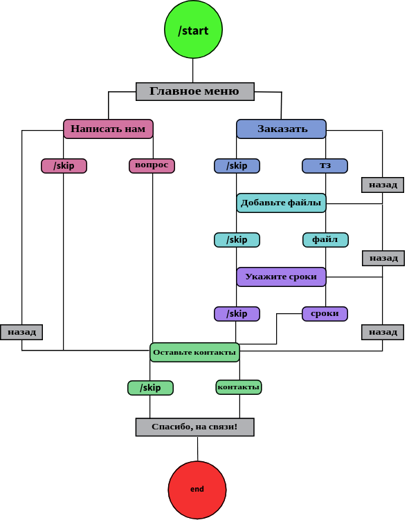

[My public Repositories ------------------->](https://github.com/sofiiila/sofiiila/blob/main/content_table.md)

# BOT_STORE
#### Бот-сборщик заявок. 
#### - Сценарий опроса клиента.
#### - Сохранение заявки.
#### - Отправка заявок на CRM.
#### - Резервирование заявок.
#### - Удаление заявок только после ответа от CRM.

# Требования
#### Для запуска этого проекта необходимо установить Docker

# Начало работы
## Установка

```bash
#Клонировать репозиторий
git clone git@github.com:sofiiila/bot-store.git

# Перейдите в директрию проекта
cd bot_store
```
## Запуск контейнера локально

```bash
docker-compose -f docker-compose-local.yml up
```
## Запуск тестов

```bash
python test.py
```

## Проверка линтерами

```bash
mypy src

pylint src
```

## Схема бота



## Status Badges


